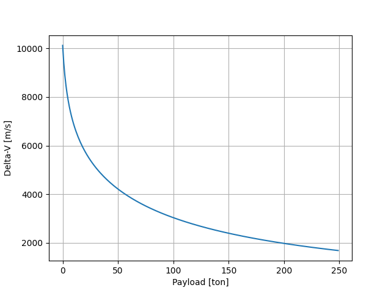

# KSPython

This is a library called KSPython, made to help people design Kerbal Space Program rockets. It features quick to use syntax for prototyping and simulations. 

## Documentation

Full documentation of functions can be found at: https://kspython.readthedocs.io/en/latest/

## Installation

Library can be installed though pip. Currently we're supporting python versions larger than 3.7 only.
```
pip install KSPython  
```

## Design Goals

KSPython was developed to be friendly to people new to python, and who are still learning the language. While also providing a powerful tool to help experienced users make fast designs.

I also envision this tool to be connected with optimization and plotting tools in the future in order to provide even more usability.

## Examples:
1) Step-by-step Asparagus rocket calculation.

We start by importing the library and the parts that we intend on using:

```python
import KSPython as ksp
from KSPython.RocketFuelTankParts import FLT400, FLT800
from KSPython.LiquidEngineParts import LVT45, LVT30
```
The library has 3 basic elements, parts, stages and rockets. Parts are usually imported and added to an stage, a stage is then added to the rocket. 

```python
rocket = ksp.Rocket('Basic Rocket Example')
main_stage = ksp.Stage()
lift_stages = ksp.Stage()
```

The main rocket stage is composed by an LV-T45 "Swivel" engine, a FL-T800 fuel tank and a Mk1 Command pod. Those two first parts were added onto the stage by means of the add_parts function, while the command pod, being just an static object for the purpose of simulation, was added by simply adding his mass.

```python
main_stage.add_parts([FLT800, LVT45])
main_stage.add_extra_mass(0.84) # Mk1 Command Pod
```

The same process is repeated for the other stage. Note that this rocket is an asparagus configuration with 6 boosters. Each stage is composed of two boosters, those can be added together.

```python
lift_stages.add_parts([FLT400]*2 + [LVT30]*2)
lift_stages.add_extra_mass(0.05*2) # FTX-2 Fuel Duct
lift_stages.add_extra_mass(0.05*2) # TT-70 Decoupler
```

The stages can then be added to a rocket. It is very important to notice that they must be added in the order that they will fire, from first stage to the last. Since the rocket uses 6 boosters, the lift stage - which has 2 boosters - was added 3 times.

By default, engines fire once their own stage is initiated, but they can be scheduled to be fired before their stage. In this example, all engines are programed to fire simultaneously at liftoff. Also, it is important to note that fuel automatically flows from one stage to the next if it can. How to prevent fuel from flowing between two stages firing simultaneously is shown in example 2.

```python
rocket.add_stages([lift_stages]*3 + [main_stage])
rocket.schedule_engine(0,1)
rocket.schedule_engine(0,2)
rocket.schedule_engine(0,3)
```

We can now use our rocket to make calculations. This library support several calculations, and also arrange them all together in a report function that can be easily called.

```python
rocket.generate_report()
```

The report generated for this rocket is the following:

```
--------------------------------------------
ROCKET REPORT
--------------------------------------------
Name: Basic Rocket Example
Mass: 28.44 Ton
Cost: 11600.0
True Delta-V: 4287.78 m/s
Total vaccum dV: 4890.06 m/s
Total atmospheric dV: 3940.7 m/s

--------------------------------------------
STAGES
--------------------------------------------
Stage: 0
Delta-V: 391.22 atm - 462.84 vac [m/s]
TWR: 5.01 atm - 5.93 vac
Engine burn time: 7.38 atm - 7.38 vac [s]

Stage: 1
Delta-V: 536.95 atm - 638.19 vac [m/s]
TWR: 4.74 atm - 5.64 vac
Engine burn time: 10.41 atm - 10.41 vac [s]

Stage: 2
Delta-V: 856.82 atm - 1029.74 vac [m/s]
TWR: 4.2 atm - 5.05 vac
Engine burn time: 17.67 atm - 17.67 vac [s]

Stage: 3
Delta-V: 2155.71 atm - 2759.31 vac [m/s]
TWR: 2.5 atm - 3.2 vac
Engine burn time: 58.4 atm - 58.4 vac [s]

--------------------------------------------
NOTES
--------------------------------------------
True delta-V is the total dV adjusted
for when the craft leaves Kerbin.
TWR calculation used g = 9.81 m/s².
Engine burn time measured at full power.
--------------------------------------------

```

2) Comparison between similar rockets, but with different fuel connections and booster efficiency.

```python
import KSPython as ksp
from KSPython.RocketFuelTankParts import X20032, FLT800
from KSPython.LiquidEngineParts import REI5, LVT30
from KSPython.BoosterParts import RT10

rocket1 = ksp.Rocket('Asparagus')
rocket2 = ksp.Rocket('Direct')
rocket3 = ksp.Rocket('Direct with no fuel connection')
rocket4 = ksp.Rocket('Direct w 4xRT10')
rocket5 = ksp.Rocket('Direct with no fuel connection w 4xRT10')
payload = 2 # Ton


main_stage = ksp.Stage()
asparagus_stage = ksp.Stage()
direct_stage = ksp.Stage()
booster_stage = ksp.Stage()

main_stage.add_parts([X20032, REI5])
asparagus_stage.add_parts([FLT800]*2 + [LVT30]*2)
direct_stage.add_parts([FLT800]*4 + [LVT30]*4)
booster_stage.add_parts([RT10]*4)

rocket1.add_stages([asparagus_stage]*2+[main_stage])
rocket1.schedule_engine(0,1)
rocket1.schedule_engine(0,2)
rocket1.change_payload(payload)
rocket1.generate_report()

rocket2.add_stages([direct_stage]+[main_stage])
rocket2.schedule_engine(0,1)
rocket2.change_payload(payload)
rocket2.generate_report()

rocket3.add_stages([direct_stage]+[main_stage])
rocket3.schedule_engine(0,1)
rocket3.change_payload(payload)
rocket3.rem_fuel_flow(0)
rocket3.generate_report()

rocket4.add_stages([booster_stage]+[direct_stage]+[main_stage])
rocket4.schedule_engine(0,1)
rocket4.schedule_engine(0,2)
rocket4.change_payload(payload)
rocket4.generate_report()

rocket5.add_stages([booster_stage]+[direct_stage]+[main_stage])
rocket5.schedule_engine(0,1)
rocket5.schedule_engine(0,2)
rocket5.change_payload(payload)
rocket5.rem_fuel_flow(1)
rocket5.generate_report()
```
Note: method *Rocket.rem_fuel_flow(stage_num)* cancels the flow of fuel between the stage *stage_num* and the next stage.

3) Designing a heavy lifter platform.

In this design, I'm looking for a lifter platform capable of howling 50 tons of cargo to low kerbin orbit, but I'm also interested in other delta-V values for different cargos. It is important to note that this example uses matplotlib.

The start of the code is similar to the last examples, but with different parts. That said, it involved a good deal of trial and error. Here just the final version is shown, but parts can be easily switched and several stages can be made and swapped in the rocket to facilitate prototyping.

```python
import KSPython as ksp
from KSPython.RocketFuelTankParts import X20016, Jumbo64
from KSPython.LiquidEngineParts import REL10, REM3
import matplotlib.pyplot as plt

rocket = ksp.Rocket('Heavy lifter')

final_stage = ksp.Stage()
main_stage = ksp.Stage()
asp_stages = ksp.Stage()


final_stage.add_parts([X20016,REL10])
main_stage.add_parts([Jumbo64,Jumbo64,REM3])
asp_stages.add_parts([Jumbo64,REM3]*2)

rocket.add_stages([asp_stages, asp_stages, asp_stages, main_stage, final_stage])

rocket.schedule_engine(0,1)
rocket.schedule_engine(0,2)
rocket.schedule_engine(0,3)
```
 To accomplish both goals of designing a rocket to get 50 tons to LKO, but also measuring it's capabilities to other missions, I've decided to plot a delta-V graph. To do so, I've used the library to calculate the delta-V value for different payloads and insert this into matplolib.

```python
dVs = []
payloads = range(250)
for mass in payloads:
    rocket.change_payload(mass)
    dVs.append(rocket.adjusted_dV())

plt.plot(payloads, dVs)
plt.xlabel('Payload [ton]')
plt.ylabel('Delta-V [m/s]')
plt.grid()
plt.show()
```

The resulting graph can be seen here:



To bring cargo to LKO, it is required around 3400 m/s of delta-V. I aimed at 4000 to have some safety margin. Which is above the delta-V value for 50 tons in the graph.

Finally, it is important to verify that the rocket has a thrust to weight ratio capable of lifting 50 Tons.

```python
rocket.change_payload(50)
rocket.generate_report()
```


## To do

* Provide support for Xenon parts
* Make it possible to include Nerv engine
* Add unit tests


If you're interesting in helping this project as a collaborator, feel free to send an email to: fred1693@hotmail.com
